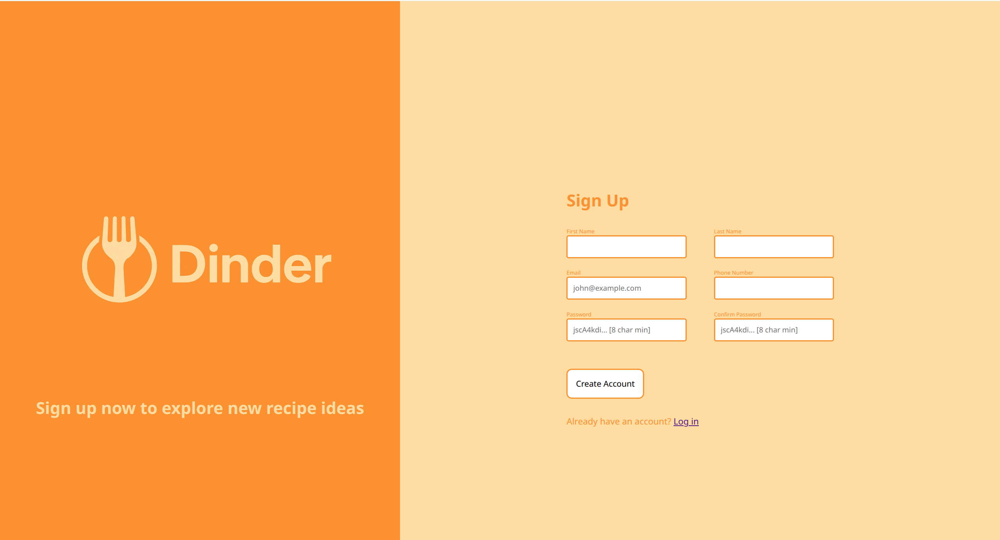

# Dinder Signup Form

This project is a responsive signup form for "Dinder," a fictional recipe-finding app. The form collects user details including name, email, phone number, and password, with built-in validation for each field. The design features a split layout with a branded logo and a modern, accessible form.

## Features

- Responsive layout using CSS Flexbox
- Custom branding and color scheme
- Basic HTML+CSS form validation for required fields, email format, phone number length, and password
- Visual feedback for valid/invalid input
- Accessible labels and placeholders

## What I Learned

- How to structure HTML forms for usability and accessibility
- Applying CSS Flexbox for responsive, split-screen layouts
- Using CSS variables for consistent theming
- Implementing input validation with HTML attributes and CSS
- Providing visual feedback for form validation states
- Organizing and styling forms for a professional look

## Preview

---

Built as part of The Odin Project.
